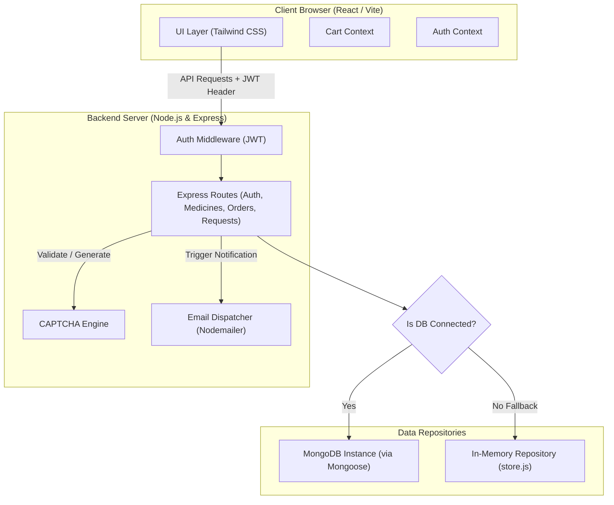

# 💊 MediQuick - Full-Stack Online Pharmacy & Admin Control Center

MediQuick is a modern, high-performance, full-stack online pharmacy retail application. It offers a secure, production-grade commerce system with roles for both customers and administrators. The application comes equipped with a custom SVG CAPTCHA generator, transactional emails, rich catalog search metrics, and an active database connection fallback engine that runs out-of-the-box with or without a MongoDB server.

---

## 🚀 Key Features

### 👤 Customer Experience
* **Smart Catalog & Interactive Search:** Real-time search across medicine names, active compositions, manufacturers, or related symptoms.
* **Smart Filter & Classification:** Filter inventory dynamically by categories like *Pain Relief*, *Antibiotics*, *Vitamins & Supplements*, *Allergy & Cold*, and *Digestive Health*.
* **Prescription & Stock Safeguards:** Dynamic badges showing if a medicine **Requires Prescription**, is **Out of Stock**, has **Low Stock**, or is **Expiring Soon**.
* **Detailed Info Modals:** View directions, uses, dosage recommendations, precautions, batch numbers, and generic alternatives.
* **Seamless Checkout:** Persistent sliding Cart Drawer featuring quantity adjustments and checkout with Cash on Delivery (COD) or UPI.
* **Interactive Portals:**
  * **Order Tracker:** Track real-time statuses (Pending, Processing, Shipped, Delivered, Cancelled) and payment states.
  * **Special Medicine Request Desk:** Submit requests for unlisted or out-of-stock medicines, specifying requested quantity, target due dates, and custom notes.

### 👑 Administrator Control Panel
* **Analytics Metrics Grid:** Display real-time data on Total Revenue, Active Customers, Pending Deliveries, Special Requests, and Out-of-Stock warnings.
* **Inventory Manager (CRUD):** Complete control to create, read, update, or delete medicines directly from the interface.
* **Order Processing Console:** View all orders, update shipping progress, and mark transaction payments (Pending, Paid, Refunded).
* **Medicine Inquiry Desk:** Reply to customer queries and special medicine requests. Replying automatically updates status and triggers email notifications.

### 🛡️ Core Infrastructure & Security
* **JWT Authentication:** Strict authorization headers protecting user transactions and administrative routes.
* **Cryptographic SVG CAPTCHA Engine:** Local Node-side captcha generator creating customized, bot-resistant SVG text captcha codes with a 5-minute automated database clean-up daemon.
* **Mongoose MongoDB & High-Performance Fallback:** Attempts connection to a local or cloud MongoDB server. If it fails, the server seamlessly runs on an in-memory repository pre-seeded with default demo data (users, orders, catalogs, requests).
* **Nodemailer SMTP Integration:** Delivers rich HTML-formatted email confirmation invoices upon checkout and status updates when admin replies to requests.

---

## 🛠️ Tech Stack

| Layer | Technologies |
| :--- | :--- |
| **Frontend** | React (Vite), Tailwind CSS, React Context API, Lucide Icons |
| **Backend** | Node.js, Express.js, JWT, Nodemailer, Crypto CAPTCHA Engine |
| **Database** | MongoDB & Mongoose (with automated In-Memory storage fallback) |

---

## 📡 Architecture Diagram



---

## 📁 Folder Structure

```text
med_sitre/
├── backend/
│   ├── middleware/
│   │   └── auth.js             # JWT Verification & Role-based Access Control
│   ├── models/
│   │   ├── Medicine.js         # Mongoose Medicine Schema
│   │   ├── Order.js            # Mongoose Order Schema
│   │   ├── RequestQuery.js     # Mongoose Special Request Schema
│   │   └── User.js             # Mongoose User Schema
│   ├── routes/
│   │   ├── auth.js             # Auth endpoints (JWT, Register, Login, CAPTCHA)
│   │   ├── medicines.js        # Medicine CRUD & Catalog endpoints
│   │   ├── orders.js           # Order placement & administrative management
│   │   └── requests.js         # User requests & administrative response panel
│   ├── utils/
│   │   ├── captcha.js          # SVG text-to-image CAPTCHA Generator
│   │   ├── email.js            # Nodemailer SMTP transporter & HTML templates
│   │   └── store.js            # In-Memory database store fallback data repository
│   ├── server.js               # Node entrypoint & fallback database connector
│   └── package.json
│
├── frontend/
│   ├── src/
│   │   ├── components/         # Reusable UI parts (Navbar, Footer, Cart, Modals)
│   │   ├── context/            # Global state stores (AuthContext, CartContext)
│   │   ├── pages/              # Routing panels (Catalog, Dashboards, Auth screens)
│   │   ├── api.js              # Centralized HTTP request modules
│   │   ├── App.jsx             # Main router & page manager
│   │   ├── main.jsx            # React root mount file
│   │   └── index.css           # Styling configuration (Tailwind directives)
│   ├── index.html
│   ├── tailwind.config.js
│   └── package.json
└── README.md
```

---

## ⚙️ Setup & Installation

### Prerequisites
* [Node.js](https://nodejs.org/) (v18.x or above)
* [Git](https://git-scm.com/)
* Optional: [MongoDB](https://www.mongodb.com/) (If not detected, the application automatically runs on seed data in-memory).

---

### Step 1: Clone the Repository
```bash
git clone https://github.com/Manvrndra955/med_sitre.git
cd med_sitre
```

---

### Step 2: Configure & Start Backend Server

1. Navigate to the backend directory:
   ```bash
   cd backend
   ```
2. Install dependency packages:
   ```bash
   npm install
   ```
3. Create a `.env` file in the `backend/` directory:
   ```env
   PORT=5000
   MONGO_URI=mongodb://localhost:27017/medstore
   JWT_SECRET=super_secret_session_key_123

   # Optional: Configuration for Email Notifications
   # If left empty, Nodemailer will automatically generate an Ethereal SMTP test account
   SMTP_HOST=smtp.gmail.com
   SMTP_PORT=587
   SMTP_USER=your_email@gmail.com
   SMTP_PASS=your_app_specific_password
   ```
4. Start the server in Development mode:
   ```bash
   npm run dev
   ```
   *You should see:* `🚀 MediQuick Online Pharmacy Server running on port 5000`

---

### Step 3: Configure & Start Frontend Client

1. Open a new terminal window and navigate to the frontend directory:
   ```bash
   cd ../frontend
   ```
2. Install dependencies:
   ```bash
   npm install
   ```
3. Run the Vite developer server:
   ```bash
   npm run dev
   ```
4. Open the displayed URL in your browser (typically `http://localhost:5173`).

---

## 🔑 Seeding & Default Credentials

To make evaluating the application effortless, the system automatically creates two accounts if they do not exist:

| Role | Username / Email | Password |
| :--- | :--- | :--- |
| **Administrator** | `admin@medstore.com` | `password123` |
| **Customer** | `user@medstore.com` | `password123` |

---

## 📬 Transactional Email Delivery Details
* **Production SMTP:** Provide correct SMTP credentials in the backend `.env` file to send real emails (e.g. via Gmail, Mailgun, SendGrid).
* **Demonstration Mode:** If no SMTP credentials are provided, Nodemailer will generate a temporary **Ethereal Mail** developer account. Transporter registration links and messages will print directly to the backend node terminal.

---

## 📄 License
Distributed under the MIT License. See `LICENSE` for more details.
